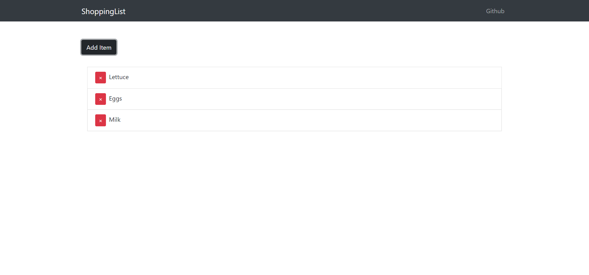
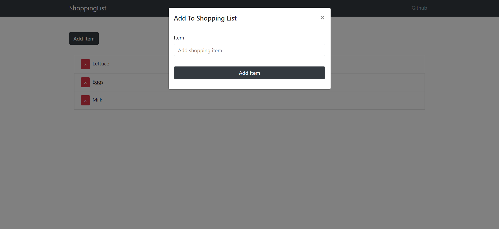

MERN Stack Shopping List

<!-- Live link to deployed app -->

Repository: https://github.com/Mdudzik92/mernstackapp 
Deployed app: https://mattsmernstackapp.herokuapp.com/

<!-- Technologies used -->

MERN (MongoDB, Express, React, Node.js)

<!-- Explanation of what the app is -->

This is an full stack app which allows the user to fill out and track their personal shopping list. They can start by clicking "Add Item" and filling out the shopping list with what they need. Once the items are added they can click the red 'X' to remove the item from their list.

<!-- Screenshot -->

<!-- License -->

MIT

<!-- Contact information -->

Email: mdudzik92@gmail.com
